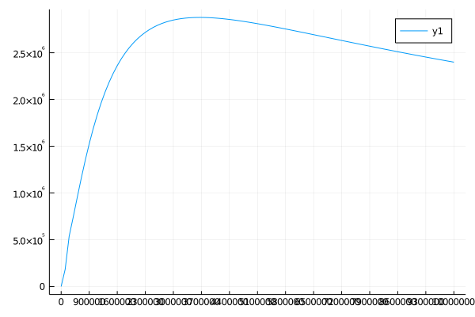

# Easy VTU interface 

## python usage examples

see examples directory

## julia usage example

Set the path for the correct python version for which the VTK wrapper/VTUIO is installed:
```julia
ENV["PYTHON"] = "/usr/bin/python3"
Pkg.build("PyCall")
```

### Load PyCall:

```julia
using PyCall
```
### Load vtuIO:

```julia
@pyimport vtuIO
```

### Read in the VTU file:

```julia
data = vtuIO.VTUIO("THM-aniso_U3ts_14_t_1400000.000000.vtu")
```


    PyObject <vtuIO.VTUIO object at 0x7feb39c9bdf0>


```julia
a=data.getFieldnames()
```


    8-element Array{String,1}:
     "HydraulicFlow"
     "NodalForces"
     "displacement"
     "pressure"
     "pressure_interpolated"
     "temperature"
     "temperature_interpolated"
     "blah"


```julia
points = data.points
```


```julia
p=data.getField("pressure")
```


    42513-element Array{Float64,1}:
         7.970611424973668e6
         7.970099998745371e6
         7.964305860621836e6
         7.960754240222736e6
         7.9664909133769935e6
         7.967123032279523e6
         7.963087129779444e6
         7.960534460888565e6
         7.968653263564663e6
         7.959611572408052e6
         7.963445087032362e6
         7.959004283678057e6
         7.943225086618663e6
         ⋮
     -5862.585898362064
     -5636.525515643107
     -6504.874632177117
     -6444.823427852529
     -6283.611377165704
     -5855.711697312881
     -6281.404017558704
     -6773.052321466211
     -5237.718109818229
     -2540.7619881152586
     -2260.7309630541195
     -2682.609737272521


## Alter the VTU file:

### define new field

```julia
pMPa = p./1e6
```


    42513-element Array{Float64,1}:
      7.970611424973668
      7.97009999874537
      7.964305860621836
      7.9607542402227365
      7.966490913376994
      7.967123032279523
      7.963087129779444
      7.960534460888565
      7.968653263564663
      7.959611572408052
      7.963445087032362
      7.959004283678056
      7.9432250866186624
      ⋮
     -0.005862585898362064
     -0.005636525515643107
     -0.006504874632177117
     -0.006444823427852529
     -0.006283611377165704
     -0.0058557116973128815
     -0.0062814040175587045
     -0.00677305232146621
     -0.005237718109818229
     -0.0025407619881152588
     -0.0022607309630541194
     -0.002682609737272521

### write new field/file


```julia
data.writeField(pMPa,"pressureMPa", "out.vtu")
```

### read in new file

```julia
data2 = vtuIO.VTUIO("out.vtu")
```


    PyObject <vtuIO.VTUIO object at 0x7feb34d9e0d0>

### show all field names


```julia
data2.getFieldnames()
```


    9-element Array{String,1}:
     "HydraulicFlow"
     "NodalForces"
     "displacement"
     "pressure"
     "pressure_interpolated"
     "temperature"
     "temperature_interpolated"
     "blah"
     "pressureMPa"


## PVD files:


```julia
pvdfile = vtuIO.PVDIO("/home/joerg/FE_test/model_test/THM/", "THM-aniso.pvd")
```


    PyObject <vtuIO.PVDIO object at 0x7feb1bb8e670>


Define a dictionary conating all points for which we want to extract time series data:

```julia
pts =Dict("pt0" =>(0.8,0.8,0.8))
```


    Dict{String,Tuple{Float64,Float64,Float64}} with 1 entry:
      "pt0" => (0.8, 0.8, 0.8)


```julia
press_pt0=pvdfile.readTimeSeries("pressure", pts=pts)
```


    Dict{Any,Any} with 1 entry:
      "pt0" => [0.0, 182551.0, 536922.0, 739003.0, 948557.0, 1.15351e6, 1.34693e6, …


```julia
using Plots
```


```julia
plot(pvdfile.timesteps,press_pt0["pt0"])
```





```julia

```


```julia

```
