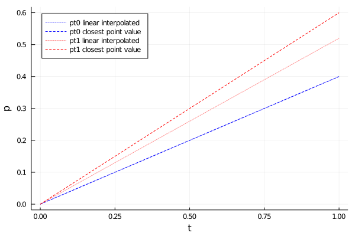
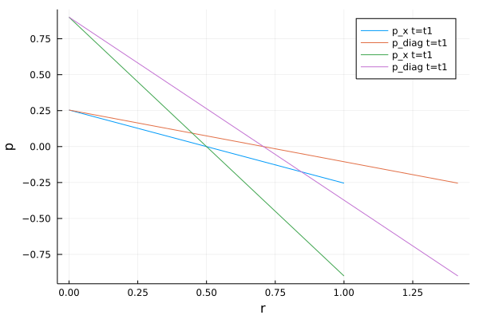

# VTUinterface 

VTUinterface is a python package for easy accessing VTU/PVD files as outputed by Finite Element software like OpenGeoSys. It uses the VTK python wrapper and linear interpolation between time steps and grid points access any points in and and time within the simulation domain.
While beeing a python package, it was also tested in Julia, where it can be accessed via PyCall:


```julia
ENV["PYTHON"] = "/usr/bin/python3"
using Pkg
#Pkg.add("PyCall")
Pkg.build("PyCall")
```

        Building Conda ─→ `~/.julia/scratchspaces/44cfe95a-1eb2-52ea-b672-e2afdf69b78f/6231e40619c15148bcb80aa19d731e629877d762/build.log`
        Building PyCall → `~/.julia/scratchspaces/44cfe95a-1eb2-52ea-b672-e2afdf69b78f/169bb8ea6b1b143c5cf57df6d34d022a7b60c6db/build.log`


```julia
using PyCall
@pyimport vtuIO
```

VTUinterface together with ogs6py can be viewed in action here:

[](https://www.youtube.com/watch?v=eihNKjK-I-s)

# 0. Installation

clone the repository and use pip to install the package

```shell
# git clone https://github.com/joergbuchwald/VTUinterface.git
# cd VTUinterface
# pip install --user .
```

Single VTU files can be accessed via:

# 1. reading a single VTU file


```julia
vtufile = vtuIO.VTUIO("examples/square_1e2_pcs_0_ts_1_t_1.000000.vtu", dim=2)
```


    PyObject <vtuIO.VTUIO object at 0x7f3f1ac976d0>


The `dim` argument is needed for correct interpolation. By defualt `dim=3` is assumed.
Basic VTU properties, like fieldnames, points and the corresponding as provided by the unstructured grid VTK class: 


```julia
fields=vtufile.getFieldnames()
```


    4-element Vector{String}:
     "D1_left_bottom_N1_right"
     "Linear_1_to_minus1"
     "pressure"
     "v"


```julia
vtufile.points
```


    121×2 Matrix{Float64}:
     0.0  0.0
     0.1  0.0
     0.2  0.0
     0.3  0.0
     0.4  0.0
     0.5  0.0
     0.6  0.0
     0.7  0.0
     0.8  0.0
     0.9  0.0
     1.0  0.0
     0.0  0.1
     0.1  0.1
     ⋮    
     1.0  0.9
     0.0  1.0
     0.1  1.0
     0.2  1.0
     0.3  1.0
     0.4  1.0
     0.5  1.0
     0.6  1.0
     0.7  1.0
     0.8  1.0
     0.9  1.0
     1.0  1.0


```julia
vtufile.getField("v")
```


    121×2 Matrix{Float64}:
     2.0   0.0
     2.0   1.62548e-16
     2.0  -9.9123e-16
     2.0  -9.39704e-16
     2.0  -4.08897e-16
     2.0   1.36785e-16
     2.0  -3.23637e-16
     2.0  -2.30016e-16
     2.0  -7.69185e-16
     2.0  -2.27994e-15
     2.0   1.53837e-15
     2.0   3.25096e-16
     2.0  -3.62815e-16
     ⋮    
     2.0  -8.88178e-16
     2.0   0.0
     2.0  -2.22045e-16
     2.0   9.9123e-16
     2.0  -1.2648e-15
     2.0   5.48137e-16
     2.0  -3.89112e-17
     2.0  -2.03185e-17
     2.0  -1.02098e-15
     2.0  -5.03586e-16
     2.0  -3.37422e-15
     2.0   8.88178e-16


Aside basic VTU properties, the field data at any given point can be retrieved:


```julia
points = Dict("pt0"=> (0.5,0.5,0.0), "pt1"=> (0.2,0.2,0.0))
```


    Dict{String, Tuple{Float64, Float64, Float64}} with 2 entries:
      "pt1" => (0.2, 0.2, 0.0)
      "pt0" => (0.5, 0.5, 0.0)


```julia
# Python: points={'pt0': (0.5,0.5,0.0), 'pt1': (0.2,0.2,0.0)} 
```


```julia
point_data = vtufile.getPointData("pressure", pts=points)
```


    Dict{Any, Any} with 2 entries:
      "pt1" => 0.6
      "pt0" => 3.41351e-17


# 2. Writing VTU files
some simple methods also exist for adding new fields to an existing VTU file or save it separately:


```julia
size = length(vtufile.getField("pressure"))
```


    121


```julia
p0 = ones(size) * 1e6;
```


```julia
# Python: size = len(vtufile.getField("pressure"))
# p0 = np.ones() *1.0e6
```


```julia
vtufile.writeField(p0, "initialPressure", "mesh_initialpressure.vtu")
```


```julia

```

A new field can also created from a three-argument function for all space-dimensions:


```julia
function p_init(x,y,z)
    if x < 0.5
        return -0.5e6
    else
        return +0.5e6
    end
end
```


    p_init (generic function with 1 method)


```julia
# Python:
# def p_init(x,y,z):
#    if x<0.5:
#        return -0.5e6
#    else:
#        return 0.5e6
```


```julia
vtufile.func2Field(p_init, "p_init", "mesh_initialpressure.vtu")
```

It is also possible to write multidimensional arrays using a function.


```julia
function null(x,y,z)
    return 0.0
end
```


    null (generic function with 1 method)


```julia
vtufile.func2mdimField([p_init,p_init,null,null], "sigma00","mesh_initialpressure.vtu")
```

# 3. Reading time-series data from PVD files:

Similar to reading VTU files, it is possible extract time series data from a list of vtufiles given as a PVD file. For extracting grid data at arbitrary points within the mesh, there are two methods available. The stadard method is linear interpolation between cell nodes and the other is the value of the closest node:


```julia
pvdfile = vtuIO.PVDIO("examples", "square_1e2_pcs_0.pvd", dim=2)
```


    PyObject <vtuIO.PVDIO object at 0x7f3efc285eb0>


```julia
pvdfile_nearest = vtuIO.PVDIO("examples", "square_1e2_pcs_0.pvd", interpolation_method="nearest", dim=2)
```


    PyObject <vtuIO.PVDIO object at 0x7f3f1ac8e190>


Timesteps can be obtained through the timesteps instance variable:


```julia
time = pvdfile.timesteps
```


    2-element Vector{Float64}:
     0.0
     1.0


```julia

```


```julia
points = Dict("pt0"=> (0.3,0.5,0.0), "pt1"=> (0.24,0.21,0.0))
```


    Dict{String, Tuple{Float64, Float64, Float64}} with 2 entries:
      "pt1" => (0.24, 0.21, 0.0)
      "pt0" => (0.3, 0.5, 0.0)


```julia
# Python: points={'pt0': (0.5,0.5,0.0), 'pt1': (0.2,0.2,0.0)} 
```


```julia
pressure_linear = pvdfile.readTimeSeries("pressure", points)
```


    Dict{Any, Any} with 2 entries:
      "pt1" => [0.0, 0.52]
      "pt0" => [0.0, 0.4]


```julia
pressure_nearest = pvdfile_nearest.readTimeSeries("pressure", points)
```


    Dict{Any, Any} with 2 entries:
      "pt1" => [0.0, 0.6]
      "pt0" => [0.0, 0.4]


```julia
using Plots
```

As point pt0 is a node in the mesh, both values at $t=1$ agree, whereas pt1 is not a mesh node point resulting in different values.


```julia
plot(time, pressure_linear["pt0"], color=:blue, linestyle=:dot, label="pt0 linear interpolated", legend=:topleft)
plot!(time, pressure_nearest["pt0"], color=:blue, linestyle=:dash, label="pt0 closest point value")
plot!(time, pressure_linear["pt1"], color=:red, linestyle=:dot, label="pt1 linear interpolated")
plot!(time, pressure_nearest["pt1"], color=:red, linestyle=:dash, label="pt1 closest point value")
xlabel!("t")
ylabel!("p")
```


    

    


# 4. Reading point set data from PVD files

Define two discretized axes:


```julia
xaxis =  [(i,0,0) for i in 0:0.01:1]
diagonal = [(i,i,0) for i in 0:0.01:1]
```


    101-element Vector{Tuple{Float64, Float64, Int64}}:
     (0.0, 0.0, 0)
     (0.01, 0.01, 0)
     (0.02, 0.02, 0)
     (0.03, 0.03, 0)
     (0.04, 0.04, 0)
     (0.05, 0.05, 0)
     (0.06, 0.06, 0)
     (0.07, 0.07, 0)
     (0.08, 0.08, 0)
     (0.09, 0.09, 0)
     (0.1, 0.1, 0)
     (0.11, 0.11, 0)
     (0.12, 0.12, 0)
     ⋮
     (0.89, 0.89, 0)
     (0.9, 0.9, 0)
     (0.91, 0.91, 0)
     (0.92, 0.92, 0)
     (0.93, 0.93, 0)
     (0.94, 0.94, 0)
     (0.95, 0.95, 0)
     (0.96, 0.96, 0)
     (0.97, 0.97, 0)
     (0.98, 0.98, 0)
     (0.99, 0.99, 0)
     (1.0, 1.0, 0)


The data along these axes should be extracted at two arbitrary distinct times (between the existing timeframes t=0.0 and t=1):


```julia
t1 = 0.2543
t2 = 0.9
```


    0.9


```julia
pressure_xaxis_t1 = pvdfile.readPointSetData(t1, "pressure", pointsetarray=xaxis);
pressure_diagonal_t1 = pvdfile.readPointSetData(t1, "pressure", pointsetarray=diagonal);
pressure_xaxis_t2 = pvdfile.readPointSetData(t2, "pressure", pointsetarray=xaxis);
pressure_diagonal_t2 = pvdfile.readPointSetData(t2, "pressure", pointsetarray=diagonal);
```


```julia
r_x = first.(xaxis[:]);
```


```julia
r_diag = sqrt.(first.(diagonal[:]).^2 + getindex.(diagonal[:],2).^2);
```


```julia
plot(r_x, pressure_xaxis_t1, label="p_x t=t1")
plot!(r_diag, pressure_diagonal_t1, label="p_diag t=t1")
plot!(r_x, pressure_xaxis_t2, label="p_x t=t1")
plot!(r_diag, pressure_diagonal_t2, label="p_diag t=t1")
xlabel!("r")
ylabel!("p")
```


    

    


# FAQ/Troubleshooting

# Troubleshooting


As the input data is triangulated with QHull for the linear interpolation it might fail at boundaries or if a wrong input dimension is given.
Possible solutions:

- Check the `dim` keyword. Two dimensional geometries assume spatial extents in x and y.
- For some meshes it might help to adjust the number of points taken into account by the triangulation, which can be done using the `nneighbors` keyword. Default value is 20.
- Especially along boundaries, nearest neighbor interpolation should be preferred. 


```julia

```
