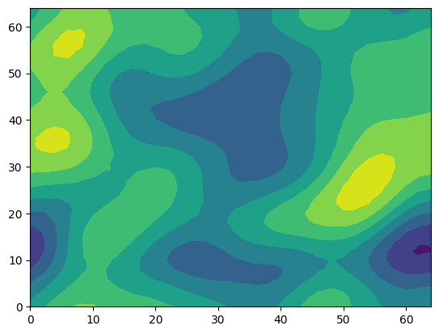
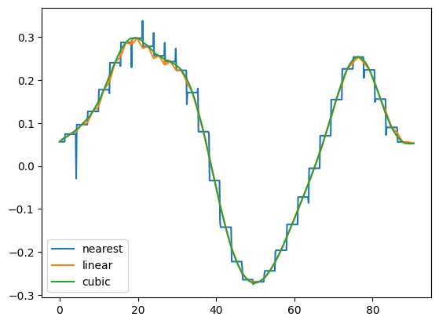
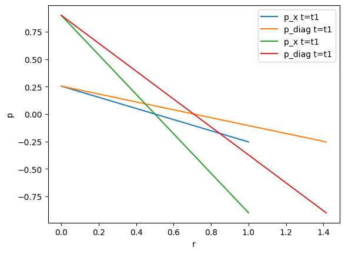

# 1. reading a single VTU file


While beeing a python package, it is also tested in Julia, where it can be accessed via PyCall:


```julia
ENV["PYTHON"] = "/usr/bin/python3"
using Pkg
#Pkg.add("PyCall")
Pkg.build("PyCall")
```


```julia
using PyCall
@pyimport vtuIO
```

Single VTU files can be accessed via:


```julia
vtufile = vtuIO.VTUIO("examples/square_1e2_pcs_0_ts_1_t_1.000000.vtu", dim=2)
```


    PyObject <vtuIO.VTUIO object at 0x7f3ccc65a760>


The `dim` argument is needed for correct interpolation. By defualt `dim=3` is assumed.
Basic VTU properties, like fieldnames, points and corresponding fielddata as provided by the unstructured grid VTK class can be simply accessed as follows: 


```julia
fields=vtufile.get_point_field_names()
```


    4-element Vector{String}:
     "D1_left_bottom_N1_right"
     "Linear_1_to_minus1"
     "pressure"
     "v"


```julia
vtufile.points[1:3]
```


    3-element Vector{Float64}:
     0.0
     0.1
     0.2


```julia
vtufile.get_point_field("v")
```


    121×2 Matrix{Float64}:
     2.0   0.0
     2.0   1.62548e-16
     2.0  -9.9123e-16
     2.0  -9.39704e-16
     2.0  -4.08897e-16
     2.0   1.36785e-16
     2.0  -3.23637e-16
     2.0  -2.30016e-16
     2.0  -7.69185e-16
     2.0  -2.27994e-15
     2.0   1.53837e-15
     2.0   3.25096e-16
     2.0  -3.62815e-16
     ⋮    
     2.0  -8.88178e-16
     2.0   0.0
     2.0  -2.22045e-16
     2.0   9.9123e-16
     2.0  -1.2648e-15
     2.0   5.48137e-16
     2.0  -3.89112e-17
     2.0  -2.03185e-17
     2.0  -1.02098e-15
     2.0  -5.03586e-16
     2.0  -3.37422e-15
     2.0   8.88178e-16


Aside basic VTU properties, the field data at any given point, e.g., pt0 and pt1


```julia
points = Dict("pt0"=> (0.5,0.5,0.0), "pt1"=> (0.2,0.2,0.0))
```


    Dict{String, Tuple{Float64, Float64, Float64}} with 2 entries:
      "pt1" => (0.2, 0.2, 0.0)
      "pt0" => (0.5, 0.5, 0.0)


can be retrieved via


```julia
point_data = vtufile.get_point_data("pressure", pts=points)
```


    Dict{Any, Any} with 2 entries:
      "pt1" => 0.6
      "pt0" => 3.41351e-17


## 1.1 Creating contour plots


```julia
using PyPlot
```


```julia
vtufile = vtuIO.VTUIO("examples/square2d_random.vtu", dim=2)
```


    PyObject <vtuIO.VTUIO object at 0x7f3ccc652220>


```julia
field = vtufile.get_point_field("gaussian_field_2");
```


```julia
triang = matplotlib.tri.Triangulation(vtufile.points[:,1], vtufile.points[:,2])
```


    PyObject <matplotlib.tri.triangulation.Triangulation object at 0x7f3c7b057670>


```julia
tricontourf(triang,field)
```


    

    


    PyObject <matplotlib.tri.tricontour.TriContourSet object at 0x7f3c76b14790>


### _This random field was created using the ranmedi package:_ https://github.com/joergbuchwald/ranmedi/

## 1.2 Extracting Pointsetdata

There are basically three interpolation methods available for extracting data at arbitrary points (`cubic` is only available for 1D and 2D). The default is `linear`.


```julia
methods = ["nearest", "linear", "cubic"];
```


```julia
diagonal = [(i,i,0) for i in 0:0.1:64];
```


```julia
vtufile = vtuIO.VTUIO("examples/square2d_random.vtu", dim=2)
data_diag = Dict()
for method in methods
    data_diag[method] = vtufile.get_point_set_data("gaussian_field_2", pointsetarray=diagonal, interpolation_method=method)
end
```


```julia
r_diag = sqrt.(first.(diagonal[:]).^2 + getindex.(diagonal[:],2).^2);
```


```julia
plot(r_diag, data_diag["nearest"], label="nearest")
plot(r_diag, data_diag["linear"], label="linear")
plot(r_diag, data_diag["cubic"], label="cubic")
legend()
```


    

    


    PyObject <matplotlib.legend.Legend object at 0x7f3cccb83520>


# 2. Writing VTU files
some simple methods also exist for adding new fields to an existing VTU file or save it separately:


```julia
vtufile = vtuIO.VTUIO("examples/square_1e2_pcs_0_ts_1_t_1.000000.vtu", dim=2)
```


    PyObject <vtuIO.VTUIO object at 0x7f3cccbb9190>


```julia
p_size = length(vtufile.get_point_field("pressure"))
```


    121


```julia
p0 = ones(p_size) * 1e6;
```


```julia
vtufile.write_field(p0, "initialPressure", "mesh_initialpressure.vtu")
```

A new field can also created from a three-argument function for all space-dimensions:


```julia
function p_init(x,y,z)
    if x < 0.5
        return -0.5e6
    else
        return +0.5e6
    end
end
```


    p_init (generic function with 1 method)


```julia
vtufile.func_to_field(p_init, "p_init", "mesh_initialpressure.vtu")
```

It is also possible to write multidimensional arrays using a function.


```julia
function null(x,y,z)
    return 0.0
end
```


    null (generic function with 1 method)


```julia
vtufile.func_to_m_dim_field([p_init,p_init,null,null], "sigma00","mesh_initialpressure.vtu")
```

# 3. Reading time-series data from PVD files:

Similar to reading VTU files, it is possible extract time series data from a list of vtufiles given as a PVD file. For extracting grid data at arbitrary points within the mesh, there are two methods available. The stadard method is linear interpolation between cell nodes and the other is the value of the closest node:


```julia
pvdfile = vtuIO.PVDIO("examples/square_1e2_pcs_0.pvd", dim=2)
```


    PyObject <vtuIO.PVDIO object at 0x7f3cccbf1550>


Timesteps can be obtained through the timesteps instance variable:


```julia
time = pvdfile.timesteps
```


    2-element Vector{Float64}:
     0.0
     1.0


```julia
points = Dict("pt0"=> (0.3,0.5,0.0), "pt1"=> (0.24,0.21,0.0))
```


    Dict{String, Tuple{Float64, Float64, Float64}} with 2 entries:
      "pt1" => (0.24, 0.21, 0.0)
      "pt0" => (0.3, 0.5, 0.0)


```julia
pressure_linear = pvdfile.read_time_series("pressure", points)
```


    Dict{Any, Any} with 2 entries:
      "pt1" => [0.0, 0.52]
      "pt0" => [0.0, 0.4]


```julia
pressure_nearest = pvdfile.read_time_series("pressure", points, interpolation_method="nearest")
```


    Dict{Any, Any} with 2 entries:
      "pt1" => [0.0, 0.6]
      "pt0" => [0.0, 0.4]


```julia
using Plots
```

As point pt0 is a node in the mesh, both values at $t=1$ agree, whereas pt1 is not a mesh node point resulting in different values.


```julia
plot(time, pressure_linear["pt0"], "b-", label="pt0 linear interpolated")
plot(time, pressure_nearest["pt0"], "b--", label="pt0 closest point value")
plot(time, pressure_linear["pt1"], "r-", label="pt1 linear interpolated")
plot(time, pressure_nearest["pt1"], "r--", label="pt1 closest point value")
legend()
xlabel("t")
ylabel("p")
```


    

    


    PyObject Text(24.000000000000007, 0.5, 'p')


# 4. Reading point set data from PVD files

Define two discretized axes:


```julia
xaxis =  [(i,0,0) for i in 0:0.01:1]
diagonal = [(i,i,0) for i in 0:0.01:1];
```

The data along these axes should be extracted at two arbitrary distinct times (between the existing timeframes t=0.0 and t=1):


```julia
t1 = 0.2543
t2 = 0.9
```


    0.9


```julia
pressure_xaxis_t1 = pvdfile.read_set_data(t1, "pressure", pointsetarray=xaxis);
pressure_diagonal_t1 = pvdfile.read_set_data(t1, "pressure", pointsetarray=diagonal);
pressure_xaxis_t2 = pvdfile.read_set_data(t2, "pressure", pointsetarray=xaxis);
pressure_diagonal_t2 = pvdfile.read_set_data(t2, "pressure", pointsetarray=diagonal);
```


```julia
r_x = first.(xaxis[:]);
```


```julia
r_diag = sqrt.(first.(diagonal[:]).^2 + getindex.(diagonal[:],2).^2);
```


```julia
plot(r_x, pressure_xaxis_t1, label="p_x t=t1")
plot(r_diag, pressure_diagonal_t1, label="p_diag t=t1")
plot(r_x, pressure_xaxis_t2, label="p_x t=t1")
plot(r_diag, pressure_diagonal_t2, label="p_diag t=t1")
xlabel("r")
ylabel("p")
legend()
```


    

    


    PyObject <matplotlib.legend.Legend object at 0x7f3c5f4d19d0>


```julia

```
