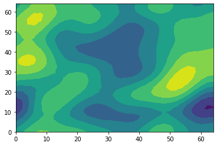
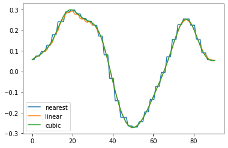
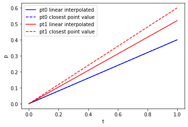
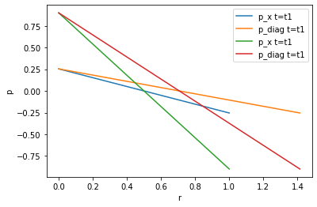

# 1. reading a single VTU file

A single VTU file can be accessed via:


```python
import vtuIO
```


```python
vtufile = vtuIO.VTUIO("examples/square_1e2_pcs_0_ts_1_t_1.000000.vtu", dim=2)
```

The `dim` argument is needed for correct interpolation. By defualt `dim=3` is assumed.
Basic VTU properties, like fieldnames, points and corresponding fielddata as provided by the unstructured grid VTK class can be simply accessed as follows: 


```python
vtufile.get_point_field_names()
```


    ['D1_left_bottom_N1_right', 'Linear_1_to_minus1', 'pressure', 'v']


points (in this example the first 3 points) can be simmply accessed with


```python
vtufile.points[0:3]
```


    array([[0. , 0. ],
           [0.1, 0. ],
           [0.2, 0. ]])


```python
vtufile.get_point_field("v")[0:3]
```


    array([[ 2.00000000e+00,  0.00000000e+00],
           [ 2.00000000e+00,  1.62547932e-16],
           [ 2.00000000e+00, -9.91229679e-16]])


Aside basic VTU properties, the field data at any given point, e.g,


```python
points={'pt0': (0.5,0.5,0.0), 'pt1': (0.2,0.2,0.0)} 
```

can be retrieved via


```python
vtufile.get_point_data("pressure", pts=points)
```


    {'pt0': 3.413510714673346e-17, 'pt1': 0.6000000000000001}


## 1.1 Creating contour plots


```python
import matplotlib.pyplot as plt
import matplotlib.tri as tri
```


```python
vtufile = vtuIO.VTUIO("examples/square2d_random.vtu", dim=2)
```


```python
field = vtufile.get_point_field("gaussian_field_2");
```


```python
triang = tri.Triangulation(vtufile.points[:,0], vtufile.points[:,1])
```


```python
plt.tricontourf(triang,field)
```


    <matplotlib.tri.tricontour.TriContourSet at 0x7f81305deac0>


    

    


### _This random field was created using the ranmedi package:_ https://github.com/joergbuchwald/ranmedi/

## 1.2 Extracting Pointsetdata

There are basically three interpolation methods available for extracting data at arbitrary points (`cubic` is only available for 1D and 2D). The default is `linear`.


```python
methods = ["nearest", "linear", "cubic"]
```


```python
import numpy as np
x = np.linspace(0.0,64,num=100);
```


```python
diagonal = [(i,i,0) for i in x];
```


```python
vtufile = vtuIO.VTUIO("examples/square2d_random.vtu", dim=2)
data_diag = {}
for method in methods:
    data_diag[method] = vtufile.get_point_set_data("gaussian_field_2", pointsetarray=diagonal, interpolation_method=method)
```


```python
r_diag = np.sqrt(2*x*x)
```


```python
for method in methods:
    plt.plot(r_diag, data_diag[method], label=method)
plt.legend()
```


    <matplotlib.legend.Legend at 0x7f81302c1e80>


    

    


# 2. Writing VTU files
some simple methods also exist for adding new fields to an existing VTU file or save it separately:


```python
vtufile = vtuIO.VTUIO("examples/square_1e2_pcs_0_ts_1_t_1.000000.vtu", dim=2)
```


```python
p_size = len(vtufile.get_point_field("pressure"))
```


```python
p0 = np.ones(p_size) * 1e6
```


```python
vtufile.write_field(p0, "initialPressure", "mesh_initialpressure.vtu")
```


```python
def p_init(x,y,z):
    if x<0.5:
        return -0.5e6
    else:
        return 0.5e6
```


```python
vtufile.func_to_field(p_init, "p_init", "mesh_initialpressure.vtu")
```


```python
def null(x,y,z):
    return 0.0
```


```python
vtufile.func_to_m_dim_field([p_init,p_init,null,null], "sigma00","mesh_initialpressure.vtu")
```

# 3. Reading time-series data from PVD files:

Similar to reading VTU files, it is possible extract time series data from a list of vtufiles given as a PVD file. For extracting grid data at arbitrary points within the mesh, there are two methods available. The stadard method is linear interpolation between cell nodes and the other is the value of the closest node:


```python
pvdfile = vtuIO.PVDIO("examples/square_1e2_pcs_0.pvd", dim=2)
```

    examples/square_1e2_pcs_0.pvd


```python
time = pvdfile.timesteps
```


```python
points={'pt0': (0.3,0.5,0.0), 'pt1': (0.24,0.21,0.0)}
```


```python
pressure_linear = pvdfile.read_time_series("pressure", points)
```


```python
pressure_nearest = pvdfile.read_time_series("pressure", points, interpolation_method="nearest")
```

As point pt0 is a node in the mesh, both values at $t=1$ agree, whereas pt1 is not a mesh node point resulting in different values.


```python
plt.plot(time, pressure_linear["pt0"], "b-", label="pt0 linear interpolated")
plt.plot(time, pressure_nearest["pt0"], "b--", label="pt0 closest point value")
plt.plot(time, pressure_linear["pt1"], "r-", label="pt1 linear interpolated")
plt.plot(time, pressure_nearest["pt1"], "r--", label="pt1 closest point value")
plt.legend()
plt.xlabel("t")
plt.ylabel("p")
```


    Text(0, 0.5, 'p')


    

    


# 4. Reading point set data from PVD files

Define two discretized axes:


```python
x = np.linspace(0,1,101)
```


```python
xaxis = [(i,0,0) for i in x]
diagonal = [(i,i,0) for i in x]
r_diag = np.sqrt(2*x*x)
```


```python
t1 = 0.2543
t2 = 0.9
```


```python
pressure_xaxis_t1 = pvdfile.read_set_data(t1, "pressure", pointsetarray=xaxis)
pressure_diagonal_t1 = pvdfile.read_set_data(t1, "pressure", pointsetarray=diagonal)
pressure_xaxis_t2 = pvdfile.read_set_data(t2, "pressure", pointsetarray=xaxis)
pressure_diagonal_t2 = pvdfile.read_set_data(t2, "pressure", pointsetarray=diagonal)
```


```python
plt.plot(x, pressure_xaxis_t1, label="p_x t=t1")
plt.plot(r_diag, pressure_diagonal_t1, label="p_diag t=t1")
plt.plot(x, pressure_xaxis_t2, label="p_x t=t1")
plt.plot(r_diag, pressure_diagonal_t2, label="p_diag t=t1")
plt.xlabel("r")
plt.ylabel("p")
plt.legend()
```


    <matplotlib.legend.Legend at 0x7f8130186850>


    

    


```python

```
